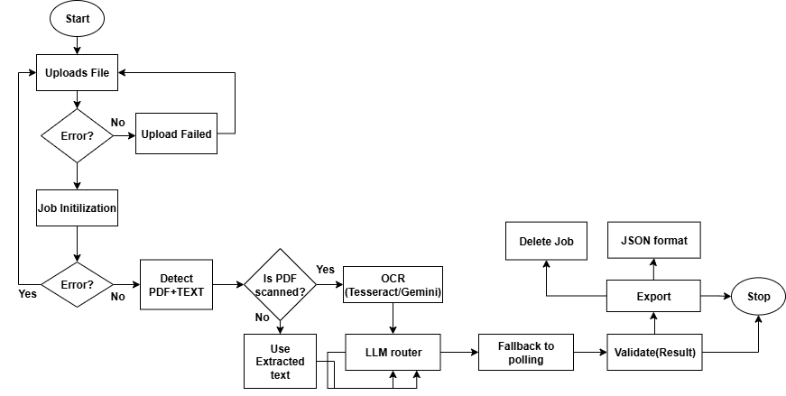

# Fexo – Full-Stack Document Processing Application

(Upload → Ingestion → Processing → Extraction → Output)

A full-stack web application that allows users to upload PDF documents, triggers processing with real-time status updates, and integrates with multiple LLMs for intelligent extraction.

Backend: FastAPI + Socket.IO for async document processing, scan detection, LLM routing, and status tracking.

Frontend: React + Material-UI dashboard with drag-and-drop upload, live job monitoring, result preview, and export.

## Contents
- Features
- Architecture and Pipeline
- Tools and Rationale
- Backend
  - Setup
  - Environment variables
  - Run
  - API
- Frontend
  - Setup
  - Run
  - UI Overview
- OCR Notes
- Troubleshooting
- Assignment Checklist
- License

---

## Features

- Upload PDFs (drag-and-drop or click)
- Start processing and get a `job_id`
- Real-time status via Socket.IO + 5s polling fallback (React Query)
- Status visualization with color-coded badges and progress bars
- Tabs for All / Active / Completed / Failed
- View output (tables and summary) in a dialog
- Download result as JSON
- Delete job from the UI list (client-side)
- KPI cards: Total Processed, In Progress, Validating, Success Rate

---

## Architecture and Pipeline



# Step 1: Upload

-Frontend: react-dropzone posts to /upload.
-Backend: saves <file_id>.pdf, returns file_id.
-Immediately calls /process to create job.

# Step 2: Job Initialize
-Backend creates jobs[job_id] = {status: "In-Progress", result: null}.
-Schedules process_document(job_id, file_path).

# Step 3: Processing
-Detects page count + text density via PyMuPDF (fitz).
-If scanned: flag OCR route (Gemini / optional Tesseract).
-LLM Router 
-Emits: "In-Progress" → "Validating".

# Step 4: Validation & Save
-Builds result JSON:
-pages, is_scanned, llm_provider/model
-tables, table_count, table_titles
-Updates job status → "Completed" (or "Failed").

# Step 5: Realtime + Polling
-Frontend listens for job_update via Socket.IO.
-Also polls /status/{job_id} every 5s using React Query.

# Step 6: Visualization + Export
-Queue UI shows live jobs with status chips.
-Actions on completion:
-View Output: dialog with extracted tables
-Download: save JSON result
-Delete: remove job (UI-only)

---

## Tools and Rationale

- FastAPI: async-friendly web framework; clean endpoint definitions.
- python-socketio: live, push-based job updates to the frontend.
- asyncio background tasks: non-blocking processing.
- PyMuPDF (fitz): fast PDF page counting and text density for scan detection.
- LlamaParse (optional): robust table extraction; provider-side handling of scanned/text PDFs. Fresh instance per request avoids event-loop reuse issues.
- OpenAI/Gemini (optional): alternate LLM providers when configured; stub fallback in dev.
- React + Vite: fast development and modern build tooling.
- Material-UI (MUI): standardized UI with badges, progress bars, cards, and dialogs.
- TanStack React Query: safe polling, retries, caching; complements websockets.
- react-dropzone: reliable drag-and-drop uploads.

---

## Backend

### Project paths

- App root: `backend/`
- App module: `backend/app/`
  - API routes: `app/api/routes_upload.py`, `routes_process.py`, `routes_status.py`
  - Processing worker: `app/jobs/process_document.py`
  - LLM router: `app/core/llm_router.py`
  - Jobs store: `app/core/jobs_store.py`
  - Socket.IO: `app/lib/socketio_server.py`

### Setup

Requirements:
- Python 3.10+
- (Optional) LLM keys (see Environment)

Install:
```bash
cd backend
python -m venv venv
# Windows:
venv\Scripts\activate
# macOS/Linux:
# source venv/bin/activate

pip install -r requirements.txt
```

### Environment variables (optional but recommended)

- `LLAMA_CLOUD_API_KEY` – enable LlamaParse provider (best table extraction)
- `OPENAI_API_KEY` – enable OpenAI path in router
- `GOOGLE_API_KEY` – enable Gemini path in router

Notes:
- If none are set, the system will use a “stub” provider so the pipeline still functions.

### Run

```bash
# from backend/
uvicorn main:app --reload --host 127.0.0.1 --port 8000
```

### API

- POST `/upload` – form-data file field `file` (.pdf only)
  - Returns: `{ file_id, filename }`
- POST `/process`
  - Body: `{ "file_id": "<returned from /upload>" }`
  - Returns: `{ job_id, status: "In-Progress" }`
  - Processing is async; job status and result are pushed via Socket.IO and available via GET status.
- GET `/status/{job_id}`
  - Returns: `{ job_id, status, result? }`

Job status lifecycle:
- In-Progress → Validating → Completed (or Failed)

Result structure (example):
```json
{
  "pages": 7,
  "is_scanned": false,
  "llm_provider": "LlamaParse",
  "llm_model": "llama-parse",
  "tables": [{ "title": "Table 1", "content": ["..."], "page_hint": 2 }],
  "table_count": 1,
  "table_titles": ["Table 1"],
  "used_stub": false
}
```

---

## Frontend

### Project paths

- App root: `frontend/`
- Entrypoint: `frontend/src/main.jsx`, `frontend/src/App.jsx`
- Components: `frontend/src/components/`
  - Upload: `UploadArea.jsx` (react-dropzone + mutations)
  - Dashboard: `Dashboard.jsx` (layout + KPI cards)
  - Stats: `StatsCards.jsx` (dynamic counts and success rate)
  - Queue: `ProcessingQueue.jsx` + `StatusDashboard.jsx` (tabs, filters, list)
  - Items: `JobItem.jsx` (badges, progress, actions: View/Download/Delete)
- Data layer: `frontend/src/api/api.jsx` (upload/process/status, download JSON)
- Realtime: `frontend/src/lib/socket.jsx`
- Hooks: `frontend/src/hooks/useJobs.jsx` (React Query polling hook)

### Setup

Requirements:
- Node.js 18+

Install:
```bash
cd frontend
npm install
```

Run:
```bash
npm run dev
# Vite dev server will start (usually http://localhost:5173)
```

Configure backend URL if needed:
- `frontend/src/api/api.jsx` – `API_BASE = "http://127.0.0.1:8000"`

### UI Overview

- Upload panel: drop PDFs, auto-upload, then auto-start processing.
- Queue: live updates via Socket.IO; polling every 5s with React Query as fallback.
- Tabs: All / Active / Completed / Failed.
- Job card:
  - Status chip: “In-Progress”, “Validating”, “Completed”, “Failed”
  - Progress bar for non-final states
  - Actions on completion:
    - View Output: dialog showing result tables and summary
    - Download: saves `result.json`
    - Delete: removes job from UI list

---

## OCR Notes

- Current detection:
  - `detect_if_scanned(file_path)`: PyMuPDF-based heuristic to flag image-heavy/scanned PDFs.
- OCR execution:
  - Provider side:
    - If `LLAMA_CLOUD_API_KEY` is set, LlamaParse typically handles image-based PDFs without manual OCR.
  - Local OCR:
    - Not implemented yet. We can add `pytesseract` + `pdf2image` or `fitz` to rasterize and OCR pages flagged as scanned, then feed the text back into the router for improved extraction.

---

## Troubleshooting

- “Event loop is closed” when parsing multiple uploads:
  - Fixed by creating a fresh LlamaParse instance per request (see `llm_router.py`).
- No tables in output:
  - If provider keys are not set, the stub provider returns a simple placeholder table.
  - Set `LLAMA_CLOUD_API_KEY` for better results, or add local OCR for scanned PDFs.
- Websocket blocked by corporate proxies:
  - The app also polls with React Query every 5s; ensure GET `/status/{job_id}` is reachable.

---

## Error Handling & Resilience

# Backend
-Rejects non-PDFs (400) at /upload.
-Missing file: /process returns 404.
-Missing job: /status/{job_id} returns 404.
-process_document wrapped in try/except → marks "Failed" and emits update.
-LlamaParse robustness: fresh instance per request; stub fallback.

#Frontend
-Upload/process wrapped in React Query mutation → onError shows Snackbar.
-Polling every 5s, retries safely; network errors don’t break UI.
-Socket.IO fallback to polling.
-Actions (View/Download) guarded until "Completed".
-Delete removes from UI list without backend dependency.
-Errors logged but UI stays functional.

## Assignment Checklist

- Frontend UI for upload, status dashboard, and error handling:
  - React + Material-UI dashboard (KPI cards, tabs, progress)
  - Upload with react-dropzone
  - Snackbars for errors
- Real-time updates:
  - Socket.IO (bidirectional)
  - Polling at 5-second intervals (React Query)
- Status visualization:
  - Color-coded badges and progress bars
- Output UX:
  - View result (tables) in dialog
  - Download result as JSON
- Backend routes and processing:
  - `/upload`, `/process`, `/status/{job_id}`
  - Async document processing with scan detection and provider routing
  - “Validating” status surfaced before completion
  - Socket.IO job updates

---

## License

Licensed under the Apache License, Version 2.0. See the [LICENSE](./LICENSE) file for details.
